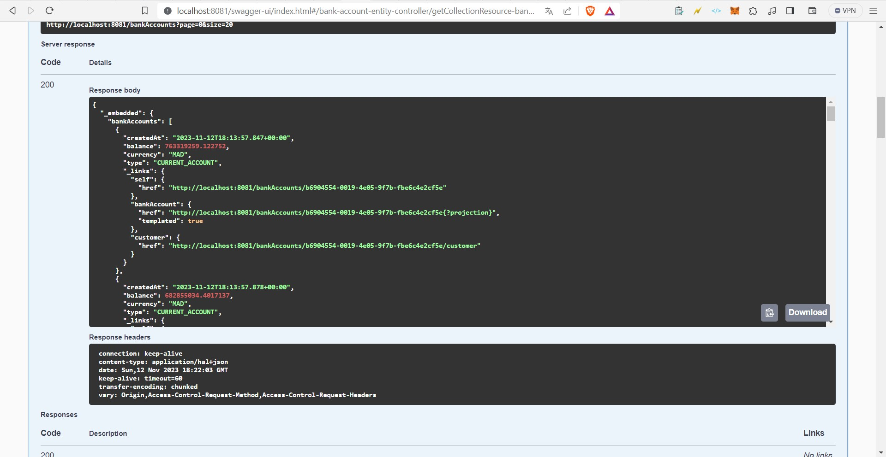
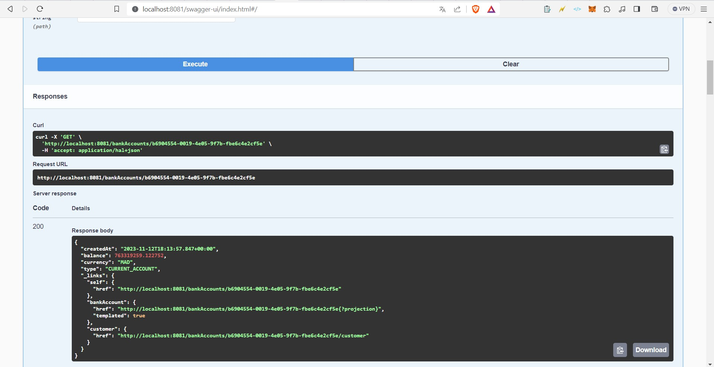
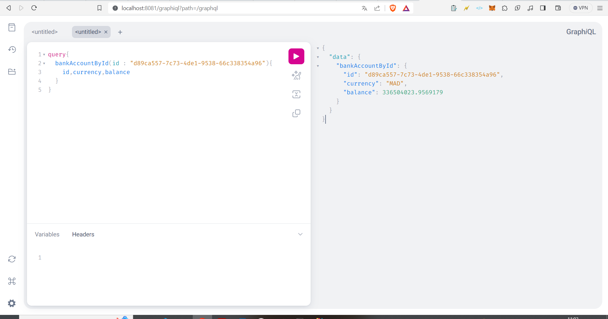
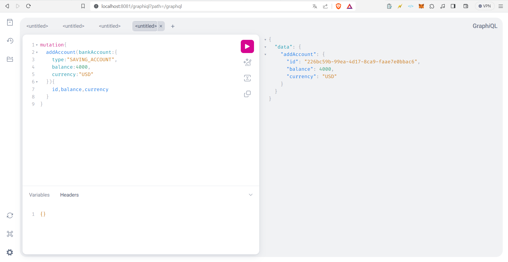
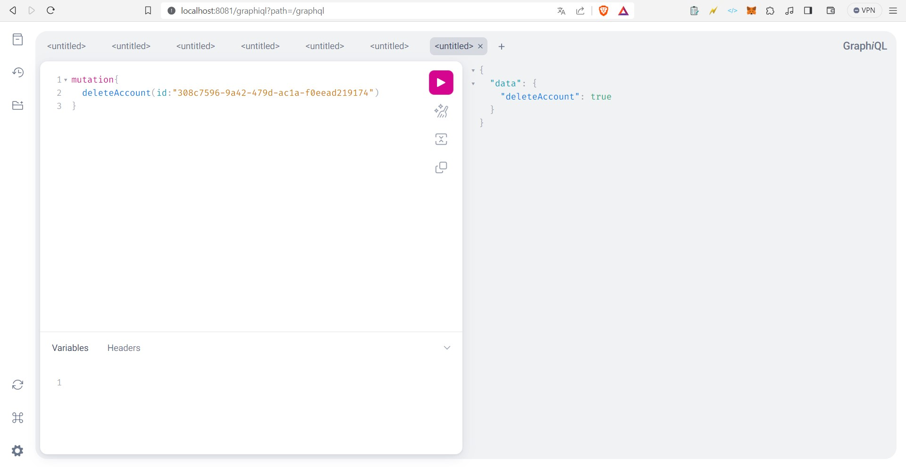
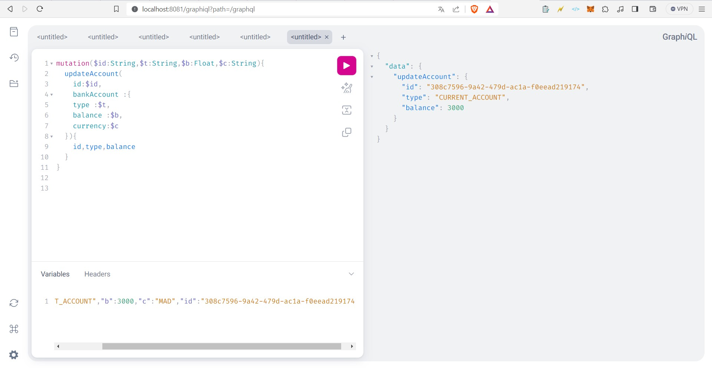

# Bank Account Service

## Overview

Welcome to the Bank Account Service! This service allows you to manage bank accounts using two connectors: Rest and GraphQL. Explore the project architecture and features to get started.

## Project Architecture

The Bank Account Service is organized into the following packages:

- **dto**: Data Transfer Objects (DTOs) for communication.
- **entities**: Core data model entities (e.g., `Account`, `Customer`).
- **enums**: Enumeration types used in the project.
- **exceptions**: Custom exceptions specific to the service.
- **mappers**: Mappers for converting between entities and DTOs.
- **repositories**: Interfaces for data access.
- **service**: Business logic and service operations.
- **web**: Controllers for handling requests and interacting with the service layer.

## Connectors

### 1. Rest Connector

The Rest connector provides a RESTful API supporting standard HTTP methods for account management operations.

### 2. GraphQL Connector

The GraphQL connector offers a GraphQL API for flexible and efficient querying of the Bank Account Service.

## Screenshots

### Swagger UI (Restful Connector)
- **Swagger UI - Get All Accounts**: 
- **Swagger UI - Get Account by ID**: 

### GraphQL Playground (GraphQL Connector)
- **GraphQL Playground - Get Account by ID**: 
- **GraphQL Playground - Add Account**: 
- **GraphQL Playground - Delete Account**: 
- **GraphQL Playground - Update Account**: 

## Documentation

Detailed information on API endpoints and operations is available in the Swagger UI for the Restful Connector and the GraphQL Playground for the GraphQL Connector.

